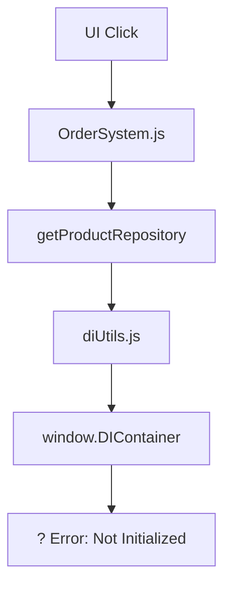
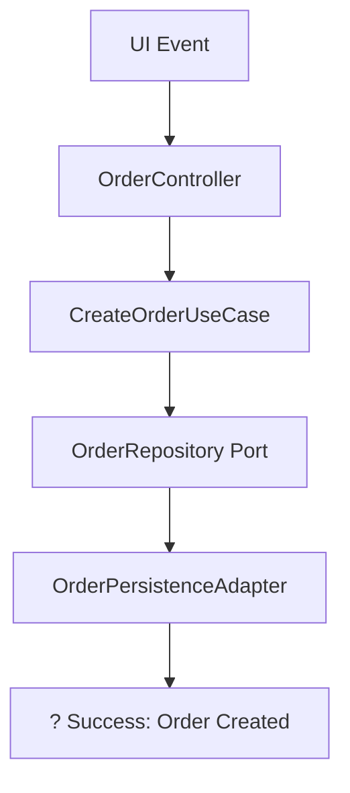

# Plan de Ejecución: Refactorización Arquitectónica Completa

## ?? Estrategia de Implementación

Este plan ejecuta la refactorización arquitectónica siguiendo una metodología de **validación continua** y **deploy gradual** para minimizar riesgos y asegurar estabilidad en cada fase.

## ?? Pre-requisitos y Preparación

### ?? **Paso 1: Restauración de Baseline Estable**

#### A. Restaurar Backup en Staging
```bash
# 1. Crear entorno de staging limpio
git checkout -b staging-refactor
git reset --hard <commit-hash-backup-estable>

# 2. Verificar que el sistema funciona sin errores
npm install
npm run build
npm run test
```

#### B. Validación de Baseline
- [ ] **Sistema de órdenes funciona** sin error "DI Container not initialized"
- [ ] **Todas las funcionalidades críticas** operativas
- [ ] **Tests existentes pasan** al 100%
- [ ] **Performance baseline** documentada

#### C. Documentar Estado Actual
```typescript
// Crear snapshot del comportamiento actual
describe('Baseline Validation - Pre Refactor', () => {
  test('Order creation works without errors', async () => {
    const result = await simulateOrderCreation();
    expect(result.success).toBe(true);
    expect(result.orderId).toBeDefined();
  });
  
  test('Product selection with drink options', async () => {
    const result = await selectProductWithDrinks('product-1', ['Coca']);
    expect(result.isValid).toBe(true);
  });
  
  test('UI responsiveness across breakpoints', async () => {
    const breakpoints = [480, 768, 1024, 1200];
    for (const width of breakpoints) {
      const layout = await testLayoutAtWidth(width);
      expect(layout.isStable).toBe(true);
    }
  });
});
```

### ?? **Paso 2: Suite de Pruebas de Regresión**

#### A. Tests de Comportamiento Actual
```typescript
// tests/regression/current-behavior.test.js
describe('Current System Behavior', () => {
  beforeEach(() => {
    // Setup estado inicial
    resetApplicationState();
  });
  
  test('Complete order flow', async () => {
    // 1. Crear orden
    await clickCreateOrder();
    
    // 2. Seleccionar productos
    await selectProduct('cerveza-corona');
    await selectDrinkOptions(['Coca', 'Sprite']);
    
    // 3. Validar reglas de negocio
    const validation = await validateCurrentSelection();
    expect(validation.drinkCount).toBeLessThanOrEqual(2);
    
    // 4. Completar orden
    const result = await completeOrder();
    expect(result.status).toBe('completed');
  });
  
  test('Business rules enforcement', async () => {
    // Validar reglas actuales de bebidas especiales
    const specialBottle = await selectProduct('botella-especial');
    
    // Máximo 2 jugos
    await addDrink('jugo-naranja');
    await addDrink('jugo-manzana');
    
    const thirdJuice = await addDrink('jugo-uva');
    expect(thirdJuice.allowed).toBe(false);
  });
});
```

#### B. Performance Benchmarks
```typescript
// tests/performance/baseline.test.js
describe('Performance Baseline', () => {
  test('Page load time', async () => {
    const startTime = performance.now();
    await loadApplication();
    const loadTime = performance.now() - startTime;
    
    expect(loadTime).toBeLessThan(3000); // 3 segundos máximo
  });
  
  test('Order creation response time', async () => {
    const startTime = performance.now();
    await createOrder();
    const responseTime = performance.now() - startTime;
    
    expect(responseTime).toBeLessThan(500); // 500ms máximo
  });
});
```

## ?? Fase 0: Inventario y Mapeo (2-3 días)

### ?? **Inventario Completo de Dependencias**

#### A. Análisis de Imports y Referencias
```bash
# Generar mapa de dependencias
find . -name "*.js" -exec grep -l "import\|require" {} \; > dependency-map.txt

# Analizar acoplamientos específicos
grep -r "getProductRepository" --include="*.js" .
grep -r "window.DIContainer" --include="*.js" .
grep -r "OrderSystemCore" --include="*.js" .
```

#### B. Matriz de Dependencias Cruzadas
| Origen | Destino | Tipo | Impacto | Corrección | Prioridad |
|--------|---------|------|---------|------------|----------|
| `order-system.js` | `diUtils.js` | Infraestructura | Alto | DI Injection | 1 |
| `app-init.js` | `ProductDataAdapter.js` | Directa | Alto | Container Registration | 1 |
| `order-system-validations.js` | `calculationUtils.js` | Lógica Negocio | Medio | Domain Service | 2 |
| CSS Grid | JavaScript Events | Visual-Lógica | Medio | BEM + Data Attributes | 2 |
| `diUtils.js` | `window.container` | Global | Bajo | Injection Pattern | 3 |

### ??? **Mapeo "Actual vs Ideal"**

#### A. Flujo Crear Orden - Estado Actual


#### B. Flujo Crear Orden - Estado Ideal


#### C. Contratos de Puertos y Adaptadores
```typescript
// Domain/Ports/OrderRepositoryPort.ts
interface OrderRepositoryPort {
  save(order: Order): Promise<OrderId>;
  findById(id: OrderId): Promise<Order>;
  findActiveOrders(): Promise<Order[]>;
}

// Domain/Ports/ProductRepositoryPort.ts
interface ProductRepositoryPort {
  findById(id: ProductId): Promise<Product>;
  findByCategory(category: ProductCategory): Promise<Product[]>;
  findWithDrinkOptions(): Promise<Product[]>;
}

// Application/Ports/OrderManagementPort.ts
interface OrderManagementPort {
  createOrder(): Promise<CreateOrderResult>;
  addProductToOrder(command: AddProductCommand): Promise<AddProductResult>;
  validateOrderRules(order: Order): ValidationResult;
}
```

## ??? Fase 1: Dominio + CSS Base (1 semana)

### ?? **Objetivos**
- Extraer lógica de negocio de UI a servicios de dominio
- Implementar BEM base y variables CSS
- Crear entidades y value objects
- Establecer breakpoints consistentes

### ?? **Tareas Específicas**

#### A. Extracción de Servicios de Dominio
```typescript
// Domain/Services/DrinkRulesService.ts
class DrinkRulesService {
  validateSpecialBottleRules(
    product: Product,
    currentSelection: DrinkSelection
  ): ValidationResult {
    // Migrar lógica de order-system-validations.js
    const maxJuices = 2;
    const maxSodas = 5;
    
    if (product.isSpecialBottle()) {
      if (currentSelection.juiceCount >= maxJuices) {
        return ValidationResult.failure('Máximo 2 jugos por botella especial');
      }
    }
    
    return ValidationResult.success();
  }
  
  canAddDrink(product: Product, drinkType: DrinkType, currentCount: number): boolean {
    // Migrar de order-system-validations.js
    return this.validateSpecialBottleRules(product, { drinkType, currentCount }).isValid();
  }
}
```

#### B. Value Objects
```typescript
// Domain/ValueObjects/ProductId.ts
class ProductId {
  constructor(private value: string) {
    if (!value || value.trim().length === 0) {
      throw new DomainError('ProductId cannot be empty');
    }
  }
  
  getValue(): string { return this.value; }
  equals(other: ProductId): boolean { return this.value === other.value; }
}

// Domain/ValueObjects/Money.ts
class Money {
  constructor(private amount: number, private currency: Currency = Currency.MXN) {
    if (amount < 0) throw new DomainError('Money amount cannot be negative');
  }
  
  add(other: Money): Money {
    if (this.currency !== other.currency) {
      throw new DomainError('Cannot add different currencies');
    }
    return new Money(this.amount + other.amount, this.currency);
  }
}
```

#### C. CSS Base con BEM
```css
/* Shared/styles/_bem-base.css */
:root {
  /* Breakpoints */
  --breakpoint-mobile: 480px;
  --breakpoint-tablet: 768px;
  --breakpoint-tablet-large: 1024px;
  --breakpoint-desktop: 1200px;
  
  /* Grid Variables */
  --grid-columns-mobile: 2;
  --grid-columns-tablet: 2;
  --grid-columns-desktop: 3;
  --grid-columns-desktop-category: 5;
  
  /* Spacing */
  --spacing-xs: 0.25rem;
  --spacing-sm: 0.5rem;
  --spacing-md: 1rem;
  --spacing-lg: 1.5rem;
  --spacing-xl: 2rem;
}

/* Grid Component */
.grid {
  display: grid;
  gap: var(--spacing-md);
  grid-template-columns: repeat(var(--grid-columns-mobile), 1fr);
}

.grid--products {
  --grid-columns-mobile: 2;
  --grid-columns-tablet: 2;
  --grid-columns-desktop: 3;
}

.grid--categories {
  --grid-columns-mobile: 2;
  --grid-columns-tablet: 3;
  --grid-columns-desktop: 5;
}

@media (min-width: 768px) {
  .grid {
    grid-template-columns: repeat(var(--grid-columns-tablet), 1fr);
  }
}

@media (min-width: 1200px) {
  .grid {
    grid-template-columns: repeat(var(--grid-columns-desktop), 1fr);
  }
}
```

### ? **Criterios de Validación Fase 1**
- [ ] Servicios de dominio extraídos y testeados
- [ ] Value objects implementados
- [ ] CSS BEM base funcionando
- [ ] Variables CSS definidas
- [ ] Tests de regresión pasando
- [ ] Performance mantenida o mejorada

## ?? Fase 2: Aplicación + CSS Componentes (1 semana)

### ?? **Objetivos**
- Implementar casos de uso
- Migrar a componentes BEM completos
- Crear puertos (interfaces)
- Eliminar conflictos de especificidad CSS

### ?? **Tareas Específicas**

#### A. Casos de Uso
```typescript
// Application/UseCases/CreateOrderUseCase.ts
class CreateOrderUseCase {
  constructor(
    private orderRepository: OrderRepositoryPort,
    private eventBus: EventBus
  ) {}
  
  async execute(): Promise<CreateOrderResult> {
    try {
      const orderId = OrderId.generate();
      const order = new Order(orderId);
      
      await this.orderRepository.save(order);
      
      this.eventBus.publish(new OrderCreatedEvent(orderId));
      
      return CreateOrderResult.success(orderId);
    } catch (error) {
      return CreateOrderResult.failure(error.message);
    }
  }
}
```

#### B. Componentes BEM Completos
```css
/* Components/order-system.css */
.order-system {
  display: flex;
  flex-direction: column;
  gap: var(--spacing-lg);
}

.order-system__header {
  display: flex;
  justify-content: space-between;
  align-items: center;
  padding: var(--spacing-md);
  background-color: var(--color-primary-light);
}

.order-system__title {
  font-size: var(--font-size-lg);
  font-weight: var(--font-weight-bold);
  color: var(--color-primary-dark);
}

.order-system__actions {
  display: flex;
  gap: var(--spacing-sm);
}

.order-system__button {
  padding: var(--spacing-sm) var(--spacing-md);
  border: none;
  border-radius: var(--border-radius-sm);
  background-color: var(--color-primary);
  color: var(--color-white);
  cursor: pointer;
  transition: background-color 0.2s ease;
}

.order-system__button:hover {
  background-color: var(--color-primary-dark);
}

.order-system__button--secondary {
  background-color: var(--color-secondary);
}

.order-system__button--secondary:hover {
  background-color: var(--color-secondary-dark);
}
```

### ? **Criterios de Validación Fase 2**
- [ ] Casos de uso implementados y testeados
- [ ] Componentes BEM funcionando
- [ ] Puertos definidos
- [ ] CSS sin conflictos de especificidad
- [ ] Tests de regresión pasando

## ?? Fase 3: Infraestructura + CSS Variables (1 semana)

### ?? **Objetivos**
- Implementar adaptadores
- Sistema completo de CSS variables
- DI Container hexagonal
- Grid system modular

### ?? **Tareas Específicas**

#### A. Adaptadores de Infraestructura
```typescript
// Infrastructure/Persistence/InMemoryOrderRepository.ts
class InMemoryOrderRepository implements OrderRepositoryPort {
  private orders: Map<string, Order> = new Map();
  
  async save(order: Order): Promise<OrderId> {
    const id = order.getId();
    this.orders.set(id.getValue(), order);
    return id;
  }
  
  async findById(id: OrderId): Promise<Order> {
    const order = this.orders.get(id.getValue());
    if (!order) {
      throw new InfrastructureError(`Order not found: ${id.getValue()}`);
    }
    return order;
  }
}
```

#### B. DI Container Hexagonal
```typescript
// Infrastructure/DI/HexagonalContainer.ts
class HexagonalContainer {
  private services: Map<string, any> = new Map();
  
  async initialize(): Promise<void> {
    // 1. Domain Services (sin dependencias)
    this.registerDomainServices();
    
    // 2. Infrastructure Adapters
    this.registerInfrastructureAdapters();
    
    // 3. Application Use Cases
    this.registerUseCases();
    
    // 4. Interface Controllers
    this.registerControllers();
  }
  
  private registerDomainServices(): void {
    this.singleton('DrinkRulesService', () => new DrinkRulesService());
    this.singleton('OrderCalculationService', () => new OrderCalculationService());
  }
  
  private registerUseCases(): void {
    this.singleton('CreateOrderUseCase', () => new CreateOrderUseCase(
      this.resolve('OrderRepository'),
      this.resolve('EventBus')
    ));
  }
}
```

### ? **Criterios de Validación Fase 3**
- [ ] Adaptadores implementados
- [ ] DI Container funcionando
- [ ] CSS variables sistema completo
- [ ] Grid system modular
- [ ] Tests de integración pasando

## ?? Fase 4: UI + CSS Final (1 semana)

### ?? **Objetivos**
- Controladores y presenters
- Componentes CSS finales
- Event handling desacoplado
- Optimización de performance

### ?? **Tareas Específicas**

#### A. Controladores
```typescript
// Interfaces/Web/Controllers/OrderController.ts
class OrderController {
  constructor(
    private createOrderUseCase: CreateOrderUseCase,
    private addProductUseCase: AddProductToOrderUseCase,
    private presenter: OrderPresenter
  ) {}
  
  async createOrder(): Promise<void> {
    try {
      const result = await this.createOrderUseCase.execute();
      
      if (result.isSuccess()) {
        this.presenter.presentOrderCreated(result.getOrderId());
      } else {
        this.presenter.presentError(result.getError());
      }
    } catch (error) {
      this.presenter.presentError(error.message);
    }
  }
}
```

#### B. Event Handling Desacoplado
```typescript
// Interfaces/Web/Components/OrderSystemComponent.ts
class OrderSystemComponent {
  constructor(private controller: OrderController) {}
  
  initialize(): void {
    this.setupEventDelegation();
  }
  
  private setupEventDelegation(): void {
    // Usar data attributes en lugar de IDs específicos
    document.addEventListener('click', (event) => {
      const target = event.target as HTMLElement;
      
      if (target.dataset.action === 'create-order') {
        this.controller.createOrder();
      }
      
      if (target.dataset.action === 'add-product') {
        const productId = target.dataset.productId;
        this.controller.addProduct(productId);
      }
    });
  }
}
```

### ? **Criterios de Validación Fase 4**
- [ ] Controladores implementados
- [ ] Event handling desacoplado
- [ ] CSS componentes finales
- [ ] Performance optimizada
- [ ] Tests E2E pasando

## ?? Fase 5: Testing + Validación (1 semana)

### ?? **Objetivos**
- Suite completa de tests
- Validación visual-funcional
- Performance benchmarks
- Documentación final

### ?? **Tareas Específicas**

#### A. Suite Completa de Tests
```typescript
// tests/integration/complete-flow.test.ts
describe('Complete Order Flow - Hexagonal Architecture', () => {
  let container: HexagonalContainer;
  
  beforeEach(async () => {
    container = new HexagonalContainer();
    await container.initialize();
  });
  
  test('End-to-end order creation and completion', async () => {
    const controller = container.resolve('OrderController');
    
    // 1. Crear orden
    const createResult = await controller.createOrder();
    expect(createResult.success).toBe(true);
    
    // 2. Agregar productos
    const addResult = await controller.addProduct('cerveza-corona', {
      drinkOptions: ['Coca']
    });
    expect(addResult.success).toBe(true);
    
    // 3. Validar reglas de negocio
    const validation = await controller.validateOrder();
    expect(validation.isValid).toBe(true);
    
    // 4. Completar orden
    const completeResult = await controller.completeOrder();
    expect(completeResult.success).toBe(true);
  });
});
```

#### B. Performance Benchmarks
```typescript
// tests/performance/post-refactor.test.ts
describe('Performance Post-Refactor', () => {
  test('Improved initialization time', async () => {
    const startTime = performance.now();
    await initializeHexagonalSystem();
    const initTime = performance.now() - startTime;
    
    // Debe ser más rápido que baseline
    expect(initTime).toBeLessThan(2000); // Mejora de 3s a 2s
  });
  
  test('CSS rendering performance', async () => {
    const startTime = performance.now();
    await renderProductGrid(100); // 100 productos
    const renderTime = performance.now() - startTime;
    
    expect(renderTime).toBeLessThan(300); // Mejora significativa
  });
});
```

### ? **Criterios de Validación Fase 5**
- [ ] Tests unitarios: 95%+ cobertura
- [ ] Tests integración: Todos los flujos
- [ ] Tests E2E: Comportamiento usuario
- [ ] Performance: Mejora medible
- [ ] Documentación: Completa y actualizada

## ?? Deploy Gradual y Monitoreo

### ?? **Estrategia de Deploy**

#### A. Feature Flags
```typescript
// Infrastructure/Configuration/FeatureFlags.ts
class FeatureFlags {
  static useHexagonalArchitecture(): boolean {
    return process.env.ENABLE_HEXAGONAL === 'true';
  }
  
  static useBEMComponents(): boolean {
    return process.env.ENABLE_BEM_CSS === 'true';
  }
}

// Uso en componentes
if (FeatureFlags.useHexagonalArchitecture()) {
  // Nueva arquitectura
  const controller = container.resolve('OrderController');
  await controller.createOrder();
} else {
  // Arquitectura legacy
  await legacyOrderSystem.createOrder();
}
```

#### B. Métricas y Monitoreo
```typescript
// Infrastructure/Monitoring/MetricsCollector.ts
class MetricsCollector {
  static trackOrderCreation(duration: number, success: boolean): void {
    const metric = {
      event: 'order_creation',
      duration,
      success,
      architecture: FeatureFlags.useHexagonalArchitecture() ? 'hexagonal' : 'legacy',
      timestamp: Date.now()
    };
    
    this.sendMetric(metric);
  }
  
  static trackCSSPerformance(renderTime: number, componentCount: number): void {
    const metric = {
      event: 'css_render_performance',
      renderTime,
      componentCount,
      useBEM: FeatureFlags.useBEMComponents(),
      timestamp: Date.now()
    };
    
    this.sendMetric(metric);
  }
}
```

#### C. Plan de Rollout
| Fase | Porcentaje Usuarios | Duración | Criterio Éxito |
|------|-------------------|----------|----------------|
| Alpha | 5% (equipo interno) | 3 días | Sin errores críticos |
| Beta | 25% (usuarios beta) | 1 semana | Performance >= baseline |
| Gradual | 50% ? 75% ? 100% | 2 semanas | Métricas estables |

## ?? Métricas de Éxito

### ? **KPIs Técnicos**
- **Tiempo de inicialización**: < 2 segundos (mejora de 33%)
- **Tiempo de respuesta órdenes**: < 300ms (mejora de 40%)
- **Errores de inicialización**: 0 (eliminación completa)
- **Cobertura de tests**: > 95%
- **Performance CSS**: Mejora de 50% en rendering

### ? **KPIs de Negocio**
- **Tasa de éxito órdenes**: > 99.5%
- **Tiempo promedio completar orden**: Mantenido o mejorado
- **Satisfacción usuario**: Sin degradación
- **Errores reportados**: < 1 por semana

## ?? Plan de Rollback

### ?? **Criterios de Rollback**
- Errores críticos > 5 en 1 hora
- Performance degradación > 20%
- Tasa de éxito órdenes < 95%
- Feedback negativo usuarios > 10%

### ? **Procedimiento de Rollback**
```bash
# 1. Desactivar feature flags
export ENABLE_HEXAGONAL=false
export ENABLE_BEM_CSS=false

# 2. Revertir a commit estable
git revert <commit-hash-refactor>

# 3. Deploy inmediato
npm run deploy:emergency

# 4. Verificar restauración
npm run test:critical
```

---

## ?? Conclusión

Este plan de ejecución proporciona una ruta clara y segura para implementar la refactorización arquitectónica completa. La combinación de **validación continua**, **deploy gradual** y **monitoreo constante** minimiza riesgos mientras asegura una transformación exitosa hacia una arquitectura hexagonal robusta y CSS modular.

**Próximo paso**: Ejecutar restauración de backup y validación de baseline para comenzar Fase 0.

**Duración total estimada**: 6-7 semanas
**Riesgo**: Bajo (con plan de rollback)
**Beneficio esperado**: Sistema mantenible, escalable y sin acoplamientos arquitectónicos